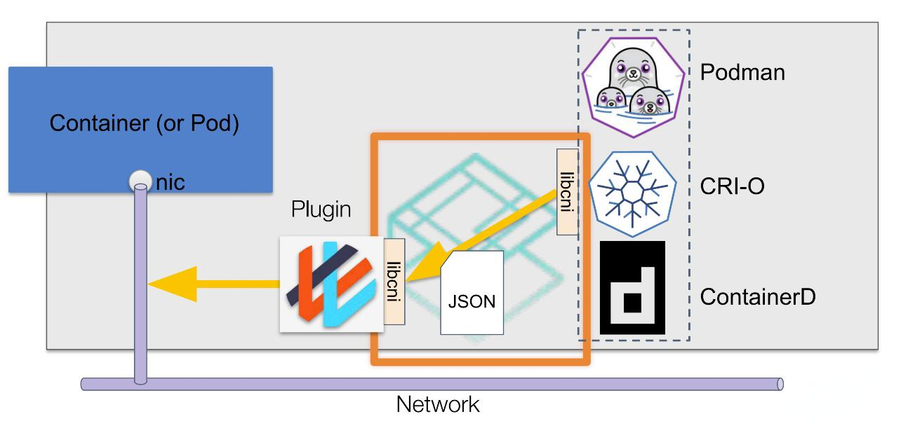

:toc:

= Container Networking Interface (CNI))

Readings

- https://kubesphere.io/zh/blogs/containerd-cni/[让容器通信变得简单：深度解析 Containerd 中的 CNI 插件]

== Ovierview

container:: is a network isolation domain, though the actual isolation technology is not defined by the specification. This could be a network namespace or a virtual machine, for example.
network:: refers to a group of endpoints that are uniquely addressable that can communicate amongst each other. This could be either an individual container (as specified above), a machine, or some other network device (e.g. a router). Containers can be conceptually added to or removed from one or more networks.
runtime:: is the program responsible for executing CNI plugins.
plugin:: is a program that applies a specified network configuration.

== CNI specification

=== Important notes

|===
|Area|Keyword|Note

|Plugin configuration objects
|`type` (string)
|Matches the name of the CNI plugin binary on disk. Must not contain characters disallowed in file paths for the system (e.g. / or \).

|Execution Protocol
|execution
|The CNI protocol is based on execution of binaries invoked by the container runtime. CNI defines the protocol between the plugin binary and the runtime.

|===

=== Execution Protocol

The CNI protocol is based on execution of binaries invoked by the container runtime. CNI defines the protocol between the plugin binary and the runtime.

A CNI plugin is responsible for configuring a container’s network interface in some manner. Plugins fall in to two broad categories:

. “**Interface**” plugins, which create a network interface inside the container and ensure it has connectivity.
. “**Chained**” plugins, which adjust the configuration of an already-created interface (but may need to create more interfaces to do so).

