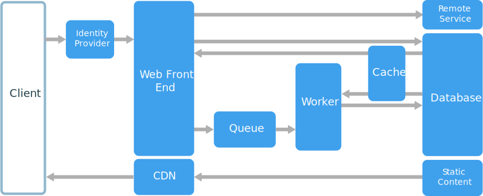

= Web-Queue-Worker architecture style
:toc:

The core components of this architecture are a web front end that serves client requests, and a worker that performs resource-intensive tasks, long-running workflows, or batch jobs. The web front end communicates with the worker through a message queue.

Other components that are commonly incorporated into this architecture include:

* One or more databases.
* A cache to store values from the database for quick reads.
* CDN to serve static content
* Remote services, such as email or SMS service. Often these are provided by third parties.
* Identity provider for authentication.

The web and worker are both stateless. Session state can be stored in a distributed cache. Any long-running work is done asynchronously by the worker. The worker can be triggered by messages on the queue, or run on a schedule for batch processing. The worker is an optional component. If there are no long-running operations, the worker can be omitted.

The front end might consist of a web API. On the client side, the web API can be consumed by a single-page application that makes AJAX calls, or by a native client application.

== When to use this architecture

The Web-Queue-Worker architecture is typically implemented using managed compute services, either Azure App Service or Azure Cloud Services.

Consider this architecture style for:

* Applications with a relatively simple domain.
* Applications with some long-running workflows or batch operations.
* When you want to use managed services, rather than infrastructure as a service (IaaS).

== Benefits

* Relatively simple architecture that is easy to understand.
* Easy to deploy and manage.
* Clear separation of concerns.
* The front end is decoupled from the worker using asynchronous messaging.
* The front end and the worker can be scaled independently.

== Challenges

* Without careful design, the front end and the worker can become large, monolithic components that are difficult to maintain and update.
* There may be hidden dependencies, if the front end and worker share data schemas or code modules.

== Best practices

* Expose a well-designed API to the client. See https://docs.microsoft.com/en-us/azure/architecture/best-practices/api-design[API design best practices].
* Autoscale to handle changes in load. See https://docs.microsoft.com/en-us/azure/architecture/best-practices/auto-scaling[Autoscaling best practices].
* Cache semi-static data. See https://docs.microsoft.com/en-us/azure/architecture/best-practices/caching[Caching best practices].
* Use a CDN to host static content. See https://docs.microsoft.com/en-us/azure/architecture/best-practices/cdn[CDN best practices].
* Use polyglot persistence when appropriate. See https://docs.microsoft.com/en-us/azure/architecture/guide/design-principles/use-the-best-data-store[Use the best data store for the job].
* Partition data to improve scalability, reduce contention, and optimize performance. See https://docs.microsoft.com/en-us/azure/architecture/best-practices/data-partitioning[Data partitioning best practices].

