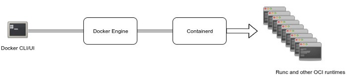

= containerd
:toc:

== Readings/References

.References
[sidebar]
****
* https://faun.pub/docker-containerd-standalone-runtimes-heres-what-you-should-know-b834ef155426[Docker, Containerd & Standalone Runtimes — Here’s What You Should Know]

****

== Introduction
Containerd is one of the recent projects in the Docker ecosystem and its purpose is breaking up more modularity to Docker architecture and more neutrality visà-vis the other industry actors (Cloud providers and other orchestration services).

According to Solomon Hykes, containerd is already deployed on millions of machines since April 2016 when it was included in Docker 1.11. The announced roadmap to extend containerd get its input from the cloud providers and actors like Alibaba Cloud, AWS, Google, IBM, Microsoft, and other active members of the container ecosystem.

More Docker engine functionality will be added to containerd so that containerd 1.0 will provide all the core primitives you need to manage containers with parity on Linux and Windows hosts:

- Container execution and supervision
- Image distribution
- Network Interfaces Management
- Local storage
- Native plumbing level API
- Full OCI support, including the extended OCI image specification

To build, ship and run containerized applications, you may continue to use Docker but if you are looking for specialized components you could consider containerd.

Docker Engine 1.11 was the first release built on runC (a runtime based on Open Container Intiative technology) and containerd.

=== Open Container Initiative (OCI)
Formed in June 2015, the *Open Container Initiative (OCI)* aims to establish common standards for software containers in order to avoid a potential fragmentation and divisions inside the container ecosystem.

It contains two specifications:
- runtime-spec: The runtime specification
- image-spec: The image specification

The runtime specification outlines how to run a filesystem bundle that is unpacked on disk:

- A standardized container bundle should contain the needed information and configurations to load and run a container in a config.json file residing in the root of the bundle directory.
- A standardized container bundle should contain a directory representing the root filesystem of the container. Generally this directory has a conventional name like rootfs.

